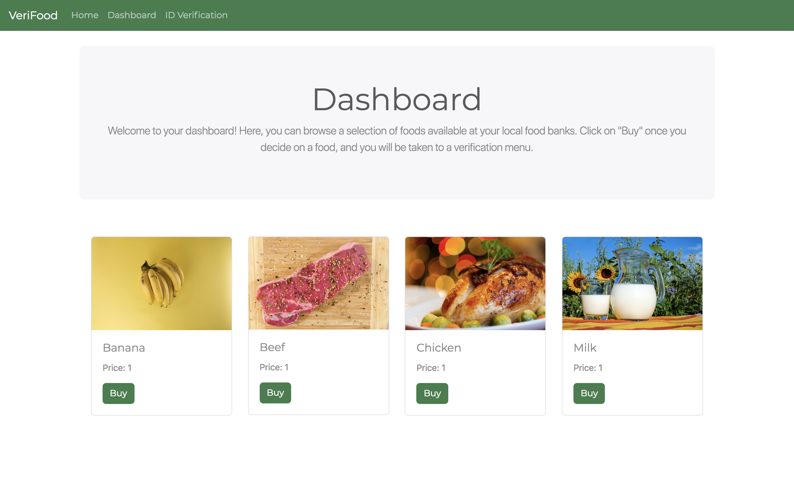
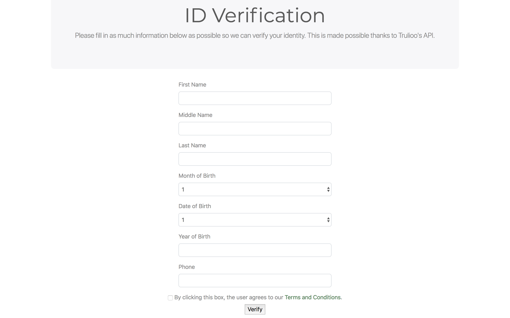

# VeriFood
VeriFood is an identity verification platform for homeless people missing legal documents to access food stamps. Food stamps are Ethereum tokens that will be used to buy food at a local food bank.
​
## Problem/Audience
Walking through Hyde Street in the Tenderloin district in San Francisco, our team was struck by drug use of homeless people. We were shook by the frequency of homeless people encountered in the streets considering San Francisco's advancement in the world. According to San Francisco's Department of Homelessness and Supportive Housing, 15% of homeless people suffer drug or alcohol abuse. There is a clear need to mitigate the homeless issue both from the city council and companies in the Bay Area.

Source: http://hsh.sfgov.org/wp-content/uploads/2017/06/San-Francisco-PIT-Executive-Summary-FINAL-6.21.17.pdf

## Experience
A user navigates to the home page which will be the food bank to buy food using Food Tokens. To get Food tokens, a user will have to verify his identity by inputting credentials in form. Once verified, a user will be awarded 20 Food tokens on his unique Ethereum wallet every 20 days to purchase food at the food bank.

# Technical
## Models

<li>User</li>
​
## Views
<li>Home (Food bank marketplace)</li>
<li>Identity verification form </li>

## Routes

Index/Home

<li>GET</li>
<li>POST</li>

Identity Verification Form

<li>GET</li>
<li>POST</li>

## Other

Languages: HTML, CSS, MongoDB, Node.js, Solidity
Technologies: Ethereum, Trulioo API, Truffle, OpenZeppelin
Colors: #3A7E4C
​
## AngelHack Hackathon Milestones
- Identity verification form (Trulio API)
- Food bank marketplace (Bootstrap)
- Ethereum wallet (Metamask)
- ERC20 Food token
​
## Demo Photos

Home page:

Dashboard page:

ID Verification form page:

